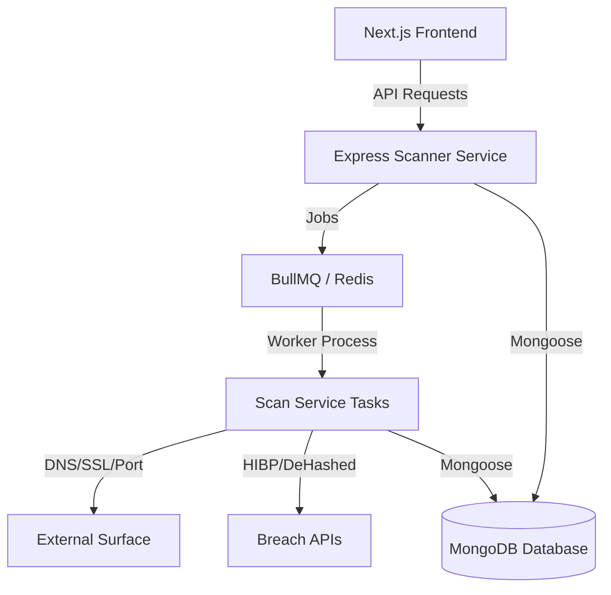

# 🛡️ CyberGuard AI — Enterprise Cybersecurity Monitoring SaaS

[](https://nextjs.org/)
[](https://expressjs.com/)
[](https://www.mongodb.com/)
[](https://opensource.org/licenses/MIT)

**CyberGuard** is a comprehensive, full-stack cybersecurity monitoring platform designed to provide real-time visibility into your organization's digital attack surface. It features automated scanning, breach detection, intelligent risk assessment, and professional multi-format reporting.

---

## ✨ Key Features

### 🔍 Surface Monitoring & Scanning
- **TCP Port Scanning**: Identifies open ports and potential entry points across common services.
- **SSL/TLS Audit**: Real-time checking of certificate expiry, weak ciphers, and trust chain validity.
- **Subdomain Discovery**: Active enumeration and DNS resolution to identify shadow IT.
- **Directory Discovery (New!)**: Proactive scanning for sensitive files (e.g., `.env`, `/config`, `/admin`) using curated **SecLists** wordlists.

### 🔐 Data Breach Detection
- **Credential Monitoring**: Integration with **Have I Been Pwned** and **DeHashed** APIs to track leaked corporate emails and passwords.
- **Real-time Alerts**: Automated email notifications when new exposures are detected.

### 📊 Risk Management & Reporting
- **Dynamic Risk Scoring**: A weighted algorithm (0-100) that categorizes organization risk from Low to Critical.
- **Multi-Format Reports**: Professional generation of security assessments in **PDF**, **Excel**, and **Word** formats.
- **Bilingual Support**: Full support for English (LTR) and Arabic (RTL) across the dashboard and all generated reports.

### ⚙️ Automation & Administration
- **Automated Scheduling**: Cron-based recurring scans (Daily/Weekly) with customizable scan types.
- **Admin Command Center**: Centralized user management, manual scan triggers, and system health monitoring.
- **Intelligent Notifications**: Weekly security digests and high-risk threshold alerts.

---

## 🏗️ Architecture



---

## 🛠️ Technology Stack

| Layer | Technologies |
| :--- | :--- |
| **Frontend** | Next.js 16, TypeScript, Tailwind CSS, DaisyUI, Recharts |
| **Backend** | Node.js, Express, TypeScript, BullMQ |
| **Database** | MongoDB (Mongoose), Redis (Queue/Cache) |
| **Reports** | PDFKit (PDF), ExcelJS (Excel), docx (Word) |
| **Security** | JWT, bcryptjs, Helmet, Express Rate Limit |
| **i18n** | next-intl (Full Localization Support) |
| **Communication** | Nodemailer (SMTP Integration) |

---

## 🚀 Getting Started

### Prerequisites
- Node.js 20+
- MongoDB 7.0
- Redis 7.2
- A free/paid HIBP or DeHashed API key (optional but recommended)

### Quick Installation

1. **Clone the repository:**
   ```bash
   git clone https://github.com/your-username/cybersec-saas.git
   cd cybersec-saas
   ```

2. **Install all dependencies:**
   ```bash
   npm install
   ```

3. **Configure Environment Variables:**
   Create a `.env` file in the root directory and the `scanner-service` directory (see [Environment Variables](#-environment-variables) below).

4. **Initialize Wordlists:**
   The project requires wordlists for subdomain and directory scanning.
   ```bash
   # Ensure data/wordlists contains:
   # subdomains.txt, directories.txt, passwords.txt
   ```

5. **Start Development Servers:**
   ```bash
   npm run dev
   ```
   - **Frontend**: `http://localhost:3000`
   - **Scanner API**: `http://localhost:4000`

---

## 🔑 Environment Variables

### Root / Frontend (`.env`)
| Variable | Description | Default |
| :--- | :--- | :--- |
| `NEXT_PUBLIC_API_URL` | Base URL for the backend API | `http://localhost:4000/api` |
| `NEXT_PUBLIC_FRONTEND_URL` | Base URL for the frontend | `http://localhost:3000` |

### Scanner Service (`scanner-service/.env`)
| Variable | Description |
| :--- | :--- |
| `MONGODB_URI` | MongoDB connection string |
| `JWT_SECRET` | Secret key for token signing |
| `REDIS_URL` | Redis connection URL |
| `HIBP_API_KEY` | Have I Been Pwned API Key (Optional) |
| `DEHASHED_API_KEY` | DeHashed API Key (Optional) |
| `DEHASHED_EMAIL` | DeHashed Account Email |
| `SMTP_HOST` | SMTP server host (e.g., smtp.gmail.com) |
| `SMTP_USER` | SMTP account email |
| `SMTP_PASS` | SMTP app password |

---

## 🌐 Arabic Localization

CyberGuard is built with the Arab market in mind.
- **RTL Layout**: Automatically switches layout direction for Arabic.
- **Arabic Reports**: Professional PDF, Excel, and Word reports with proper Arabic font embedding and RTL alignment.
- **Translation Keys**: All UI elements are managed via `app/messages/ar.json`.

---


## 📄 License

Distributed under the MIT License. See `LICENSE` for more information.

---

## 🤝 Contributing

Contributions are what make the open-source community such an amazing place to learn, inspire, and create. Any contributions you make are **greatly appreciated**.

1. Fork the Project
2. Create your Feature Branch (`git checkout -b feature/AmazingFeature`)
3. Commit your Changes (`git commit -m 'Add some AmazingFeature'`)
4. Push to the Branch (`git push origin feature/AmazingFeature`)
5. Open a Pull Request

---

Developed with ❤️ for a safer web.
